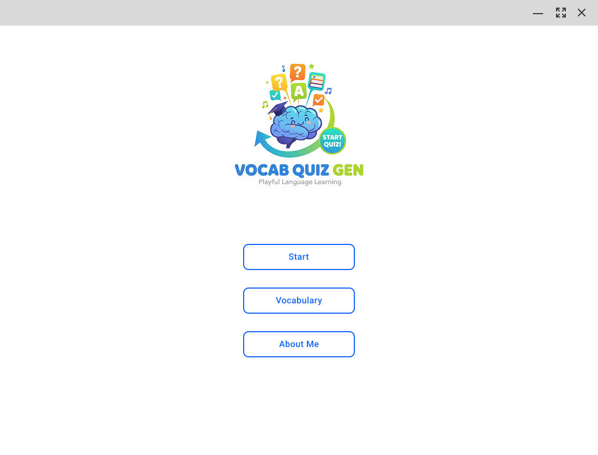
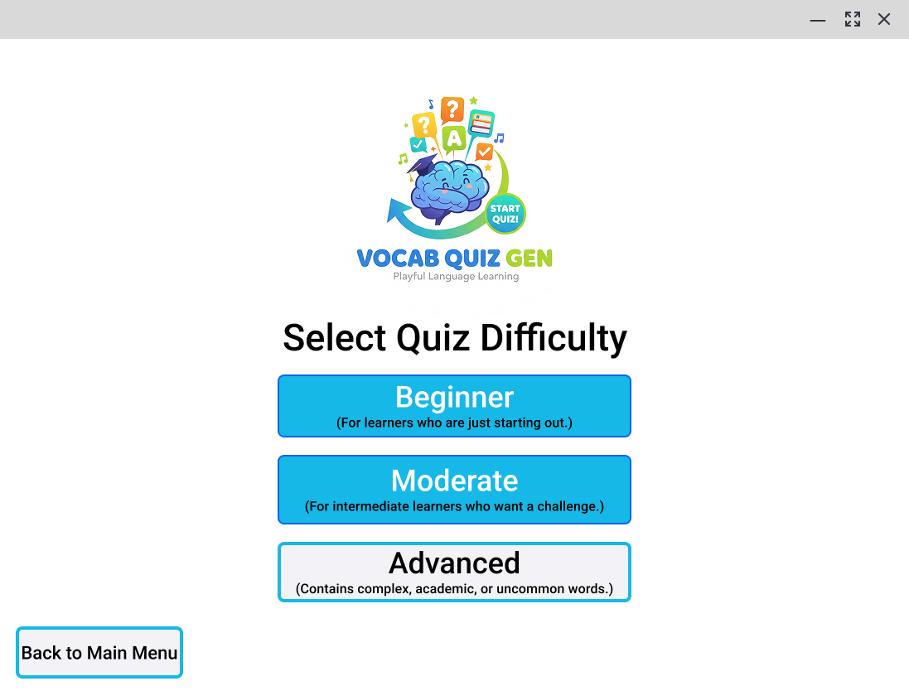
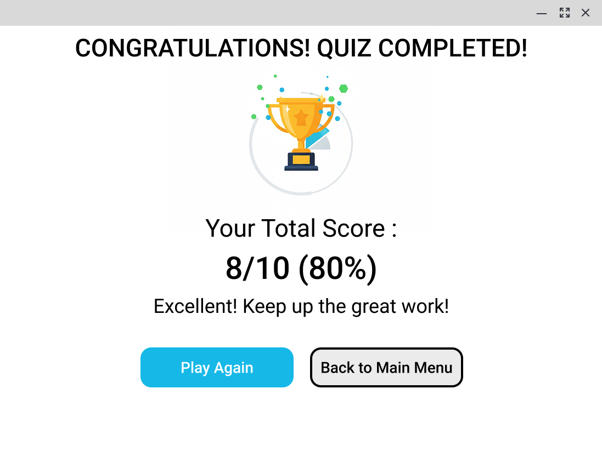

# Design Rationale: Vocabulary Quiz Generator

## 1. Introduction
เอกสารนี้มีวัตถุประสงค์เพื่ออธิบายเหตุผลและหลักการที่ใช้ในการออกแบบส่วนติดต่อผู้ใช้ (User Interface - UI) และประสบการณ์ผู้ใช้ (User Experience - UX) ของแอปพลิเคชัน Vocabulary Quiz Generator โดยเน้นที่การสร้างประสบการณ์การใช้งานที่เป็นมิตร เข้าใจง่าย และส่งเสริมการเรียนรู้คำศัพท์อย่างมีประสิทธิภาพ

## 2. Overall Design
การออกแบบเน้นความเรียบง่าย (Simplicity), ความชัดเจน (Clarity), และความน่าใช้งาน (Engagement) เพื่อให้ผู้ใช้ทุกระดับสามารถใช้งานได้โดยไม่สับสน และรู้สึกสนุกกับการเรียนรู้

## 3. UI Elements & Layout Choices 

### 3.1. Main Menu
* **Layout:**
    * **Centralized Content:** จัดวางโลโก้และปุ่มต่างๆ ไว้ตรงกลางหน้าจอ เพื่อให้ความสำคัญกับ Brand Identity และสร้างจุดโฟกัสที่ชัดเจน ทำให้ผู้ใช้รู้ทันทีว่าต้องเริ่มจากตรงไหน
    * **Button Stack:** จัดวางปุ่มในแนวตั้ง เพื่อให้ผู้ใช้เลื่อนสายตาจากบนลงล่างตามลำดับความสำคัญ (Start, Vocabulary, About Me) และง่ายต่อการกดบนอุปกรณ์ต่างๆ
* **Buttons:**
    * **Prominent "Start" Button:** ปุ่ม "Start" มีขนาดใหญ่และเป็นสีฟ้าเด่นชัด (Primary Action) เพื่อเชิญชวนให้ผู้ใช้เริ่มใช้งานฟังก์ชันหลักของแอปพลิเคชัน
    * **Secondary Buttons:** ปุ่ม "Vocabulary" และ "About Me" แสดงถึงฟังก์ชันเสริมที่ไม่ใช่การทำงานหลัก
* **Branding:** โลโก้ "VOCAB QUIZ GEN" ที่มีภาพสมองและองค์ประกอบการเรียนรู้ สื่อถึงจุดประสงค์ของแอปพลิเคชันและสร้างความเป็นมิตร

### 3.2. Difficulty Selection
* **Layout:**
    * **Clear Heading:** หัวข้อ "Select Quiz Difficulty" ชัดเจน ทำให้ผู้ใช้เข้าใจวัตถุประสงค์ของหน้านี้ทันที
    * **Stacked Difficulty Options:** จัดเรียงตัวเลือกความยากในแนวตั้ง พร้อมคำอธิบายสั้นๆ ใต้แต่ละตัวเลือก เพื่อให้ผู้ใช้สามารถตัดสินใจเลือกได้อย่างเหมาะสมกับระดับความสามารถของตนเอง
* **Buttons:**
    * **Distinct Difficulty Levels:** ปุ่มแต่ละระดับ (Beginner, Moderate, Advanced) มีคำอธิบาย เพื่อให้ผู้ใช้ทราบถึงความแตกต่างของแต่ละระดับอย่างชัดเจน
    * **"Back to Main Menu" Button:** วางไว้ที่มุมล่างซ้ายเพื่อเป็น Navigation กลับไปยังหน้าหลัก โดยใช้ขนาดที่แตกต่างจากปุ่มเลือกความยาก เพื่อไม่ให้สับสนว่าเป็นตัวเลือกความยาก แต่ยังคงความสำคัญในการนำทาง

### 3.3 Quiz Interface
* **Layout:**
    * **Question Prominence:** คำถาม (What does "ephemeral" mean?) ถูกจัดวางให้เด่นชัดอยู่กลางหน้าจอ ด้วย Font Size ที่ใหญ่และสีที่แตกต่าง เพื่อให้ผู้ใช้โฟกัสที่คำถามเป็นอันดับแรก
    * **Category/Difficulty Tags:** แสดงระดับความยาก เช่น "Advanced" ที่มุมบนซ้าย เพื่อให้ผู้ใช้ทราบระดับความยาก
    * **Clear Answer Options:** ตัวเลือกคำตอบจัดเรียงในแนวตั้งอย่างเป็นระเบียบ แต่ละตัวเลือกอยู่ในกรอบสี่เหลี่ยมที่กดง่าย
    * **Progress Indicator:** "Question : 1/10" แสดงอยู่ด้านล่าง เพื่อให้ผู้ใช้ทราบว่าทำไปแล้วกี่ข้อและเหลืออีกกี่ข้อ ช่วยลดความกังวลและสร้างความคาดหวัง

### 3.4 Quiz Completion
* **Layout:**
    * **Celebratory Message:** "CONGRATULATIONS! QUIZ COMPLETED!" พร้อมไอคอนถ้วยรางวัล สร้างความรู้สึกยินดีและประสบความสำเร็จแก่ผู้ใช้
    * **Score Prominence:** แสดงคะแนนรวม "8/10 (80%)" ด้วย Font Size ที่ใหญ่และโดดเด่น เพื่อให้ผู้ใช้เห็นผลลัพธ์หลักของการทำแบบทดสอบอย่างชัดเจน
    * **Encouraging Message:** "Excellent! Keep up the great work!" เป็นการให้กำลังใจและกระตุ้นให้ผู้ใช้กลับมาใช้งานอีก
* **Buttons:**
    * **"Play Again" (Primary Action):** ปุ่มสีฟ้าเด่นชัด เพื่อกระตุ้นให้ผู้ใช้ทำแบบทดสอบซ้ำหรือเริ่มชุดใหม่ทันที
    * **"Back to Main Menu" (Secondary Action):** ปุ่มขอบสีฟ้า แสดงถึงทางเลือกในการกลับหน้าหลัก เพื่อพักหรือเปลี่ยนไปทำกิจกรรมอื่น

## 4. Color Palette (โทนสี)
* **Dominant Colors:** เน้นสีขาวเป็นพื้นหลัง (Clarity, Cleanliness) ตัดด้วยสีฟ้า (Trust, Calm, Intelligence) 
* **Purpose:**
    * **Blue:** ใช้สำหรับปุ่มหลักและการเน้นข้อความสำคัญ สื่อถึงความน่าเชื่อถือและความเป็นมืออาชีพ
    * **Minimalist Approach:** การใช้สีอย่างจำกัดช่วยลดความซับซ้อนของ UI ทำให้ข้อมูลและ Interactive Elements โดดเด่นขึ้นมา

## 5. Typography
* **Readability:** เลือกใช้ Font ที่อ่านง่ายและชัดเจน เพื่อให้ผู้ใช้สามารถอ่านคำถาม ตัวเลือก และข้อมูลต่างๆ ได้อย่างรวดเร็วและสบายตา
* **Hierarchy:** ใช้ขนาด Font ที่แตกต่างกันเพื่อสร้างลำดับชั้นของข้อมูล (เช่น คำถามใหญ่กว่าตัวเลือก) ช่วยนำสายตาของผู้ใช้ไปยังส่วนที่สำคัญที่สุดก่อน

## 6. User Flow 
ผู้ใช้สามารถดำเนินการได้อย่างเป็นธรรมชาติ:
1.  **Start:** จากหน้าหลัก เลือก "Start"
2.  **Select Difficulty:** เลือกความยากที่ต้องการ
3.  **Quiz:** ทำแบบทดสอบทีละข้อ
4.  **Feedback:** ได้รับ Feedback ทันทีหลังตอบแต่ละข้อ
5.  **Summary:** เห็นสรุปคะแนนเมื่อจบการทดสอบ และเลือก "Play Again" หรือ "Back to Main Menu"

## 7. Conclusion
การออกแบบ UI/UX ของ Vocabulary Quiz Generator มุ่งเน้นไปที่การสร้างประสบการณ์ที่เข้าใจง่าย มีประสิทธิภาพ และน่าดึงดูดใจ เพื่อสนับสนุนผู้ใช้ในการเรียนรู้คำศัพท์และเพิ่มพูนทักษะภาษาอังกฤษของตนเอง