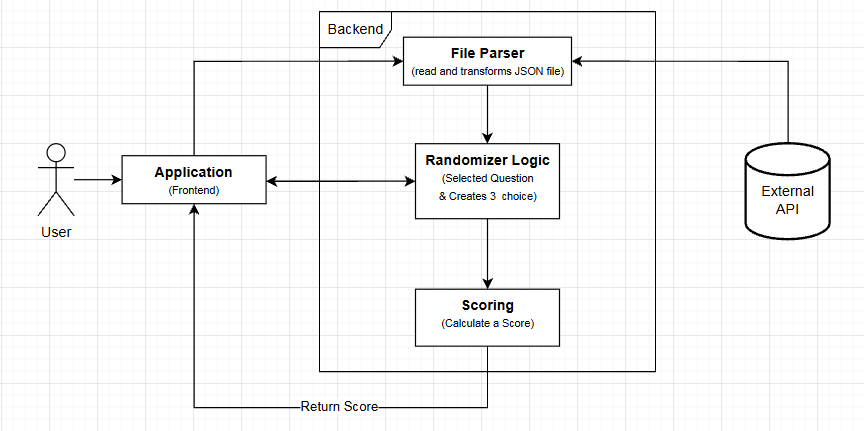

# Technology Stack Justification

## 1. Programming Language
### Selected Technology: Java
* **Role:** ภาษาหลักในการพัฒนา Application Logic, Data Processing และ GUI
* **Justification (เหตุผลที่เลือก):**
    1. **Strong OOP Support:** เหมาะสำหรับการทำระบบ Quiz ที่มี Object ชัดเจน (เช่น Question, User, Score) ตามหลักการ Object-Oriented Programming
    2. **Platform Independence:** สามารถรันได้บนทุก OS (Windows/Mac/Linux) ที่มี JVM
    3. **Rich Libraries:** มี Library สนับสนุนการทำงานที่หลากหลาย ทั้งการจัดการไฟล์และการแสดงผลกราฟิก

## 2. User Interface Framework
### Selected Technology: Java Swing
* **Role:** ใช้สร้างหน้าต่างโปรแกรม (JFrame), ปุ่มกด และการจัดวาง Layout
* **Justification (เหตุผลที่เลือก):**
    1. **NetBeans Integration:** สามารถใช้เครื่องมือ GUI Builder ของ NetBeans ออกแบบหน้าตาโปรแกรมด้วยการลากวาง (Drag-and-Drop) ได้สะดวกและรวดเร็ว
    2. **Native Look & Feel:** สามารถปรับแต่งให้หน้าตาโปรแกรมเข้ากับระบบปฏิบัติการที่ใช้งานได้
    3. **Lightweight:** ไม่ต้องติดตั้ง Runtime ขนาดใหญ่เพิ่มเติมเหมือน Framework ใหม่ๆ บางตัว

## 3. Data Storage
### Selected Technology: JSON File (.json)
* **Role:** เก็บข้อมูลคำศัพท์และตัวเลือก (คำศัพท์, คำแปล, หมวดหมู่, ระดับความยาก)
* **Justification (เหตุผลที่เลือก):**
    1. **Structured Data:** จัดการโครงสร้างข้อมูลได้ดีกว่า Text/CSV (เช่น การเก็บ Array ของตัวเลือก หรือการแบ่งหมวดหมู่ซ้อนกัน)
    2. **Object Mapping:** สามารถแปลงข้อมูลจากไฟล์ JSON เป็น Java Objects ได้ง่าย (โดยใช้ Library เช่น Jackson หรือ Gson หรือ Built-in parser)
    3. **Industry Standard:** เป็นรูปแบบการแลกเปลี่ยนข้อมูลมาตรฐานในปัจจุบัน การเรียนรู้ไว้จะเป็นประโยชน์ต่อการทำงานจริงในอนาคต

## 4. Design & Prototyping Tool
### Selected Technology: Figma
* **Role:** ออกแบบ Wireframe, UI Layout และเลือกโทนสี (Color Palette)
* **Justification (เหตุผลที่เลือก):**
    1. **Visualizing Flow:** ช่วยให้เห็นภาพรวมการทำงานและการเชื่อมต่อของแต่ละหน้าจอ (States) ได้ชัดเจนก่อนลงมือเขียนโค้ด
    2. **UI Accuracy:** ช่วยให้กำหนดขนาดและตำแหน่งของ Component ต่างๆ ได้แม่นยำเมื่อนำไปสร้างจริงใน NetBeans

## 5. Development Environment (IDE)
### Selected Technology: Apache NetBeans IDE 27 & VS Code
* **Role:** เครื่องมือหลักในการพัฒนา (NetBeans) และเครื่องมือเสริมสำหรับจัดการเอกสาร (VS Code)
* **Justification (เหตุผลที่เลือก):**
    * **Apache NetBeans:**
        1. **Matisse GUI Builder:** มีเครื่องมือออกแบบ GUI ที่ทรงพลังที่สุดสำหรับ Java Swing ช่วยลดเวลาในการเขียนโค้ดส่วน Interface ได้มหาศาล
        2. **Project Management:** จัดการ Structure ของ Java Project และ Library (Dependencies) ได้อย่างเป็นระบบ
    * **VS Code:**
        1. **Documentation:** เหมาะสำหรับเขียนและพรีวิวเอกสาร Markdown (.md) เช่น User Stories และ Scope Document
        2. **JSON Editing:** มีส่วนเสริมที่ช่วยจัดรูปแบบ (Format) และตรวจสอบความถูกต้องของไฟล์ JSON ข้อมูลดิบได้ดีกว่า IDE ทั่วไป