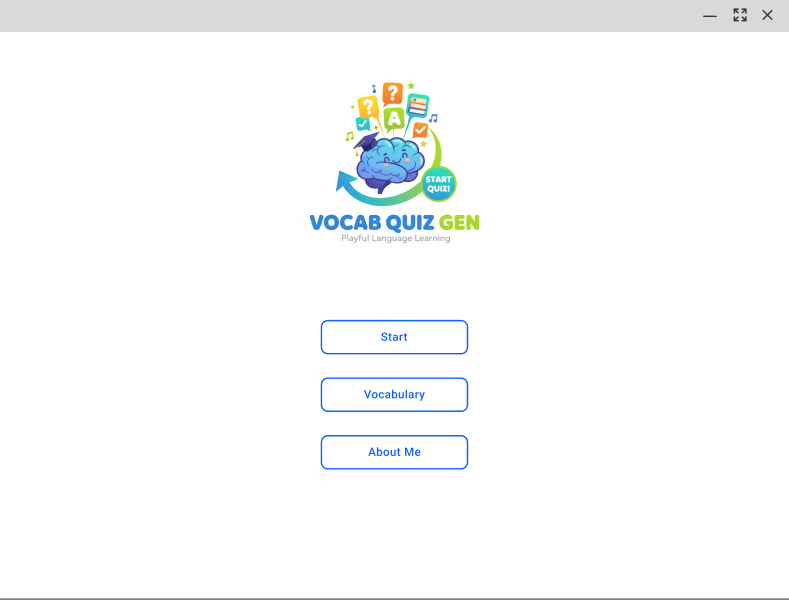

# Vocabulary Quiz Generator 🧠

  

A Vocabulary Quiz application developed using **Java Swing** and **OOP principles**. This project is part of the **CS436 Software Engineering** course. The application loads vocabulary data from a JSON file, generates random quizzes, and tracks the user's score.

## 📷 Screenshots

*(Note: Screenshot showing the main interface)*

## ✨ Features
- **External Data Loading:** Reads vocabulary data dynamically from `vocab_data.json`.
- **Quiz Logic:** Randomizes questions and choices (1 correct, 3 distractors).
- **Difficulty Selection:** Supports Beginner, Moderate, and Advanced levels.
- **Scoring System:** Real-time feedback and final score summary.
- **User Interface:** Clean and user-friendly GUI built with Java Swing.

## 🛠 Tech Stack
- **Programming Language:** Java (JDK 21 recommended)
- **GUI Framework:** Java Swing
- **IDE:** Apache NetBeans IDE 27
- **Data Format:** JSON

## 🚀 Installation & Setup

### Prerequisites
Ensure you have the following installed:
1.  **Java Development Kit (JDK) 8 or higher** (JDK 21 is recommended).
2.  **Apache NetBeans** (or any Java IDE like IntelliJ/Eclipse).

### Steps to Clone and Open
1.  **Clone the repository:**
    ```bash
    git clone [https://github.com/mrsho240/Project_Vocabulary.git](https://github.com/mrsho240/Project_Vocabulary.git)
    ```
2.  **Open in NetBeans:**
    - Open Apache NetBeans.
    - Go to `File` > `Open Project`.
    - Select the cloned folder.

3.  **Setup Data File:**
    - Ensure `vocab_data.json` is located in the **project root directory** (same level as `src` folder) or strictly follows the path defined in the code.

## ▶️ How to Run

### Option 1: Run via IDE (Recommended)
1.  Open the project in NetBeans.
2.  Locate `frame_Main.java` in the source packages.
3.  Right-click and select **Run File** (or press `Shift + F6`).

